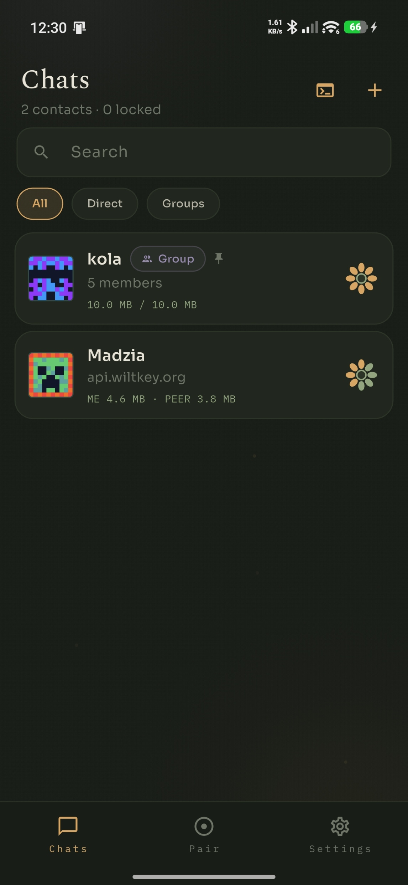
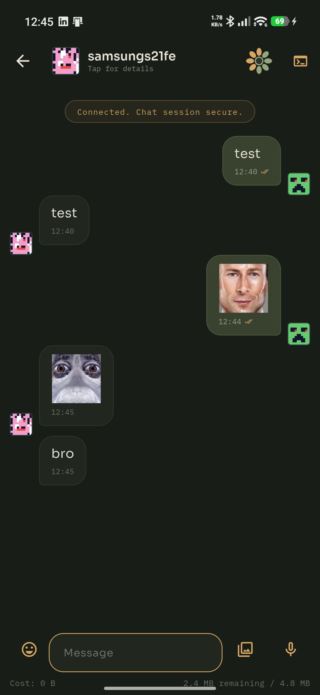
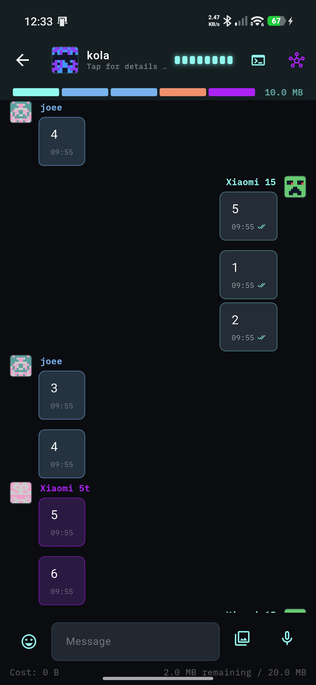
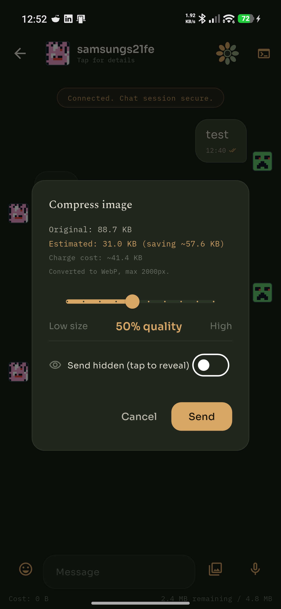
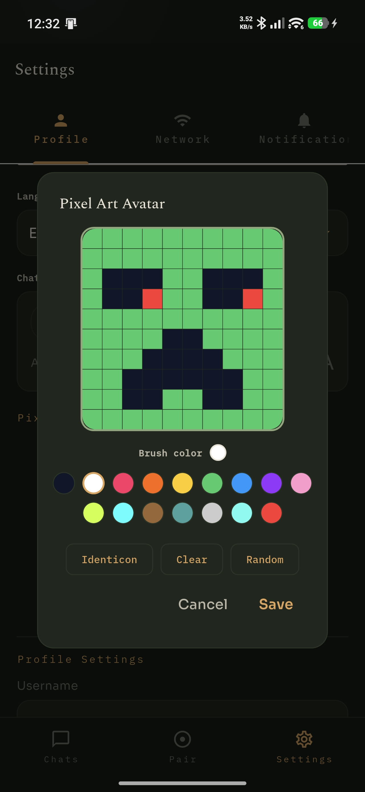
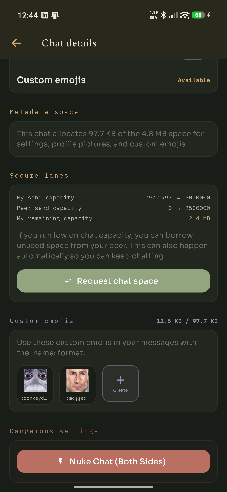

<div align="center">

# WiltKey

**A private messenger for people who'd rather be off their phone. Make friends you actually see IRL**

`v1.0.0` · Android · MPL-2.0 · made by [ArtFacility](https://github.com/ArtFacility)

</div>

> ⚠️ **Heads up:** this is the first semi-stable release. It works and I daily-drive it, but it's still very much a work in progress — expect rough edges, weird messaging behavior, and the occasional bugs. Issues and suggestions welcome.

---

WiltKey is an encrypted chat app built on simple idea: Only people you actually know in real life are in your contacts and the people worth talking to are the ones you actually meet. So instead of accounts, phone numbers, or "add me by username," you add a contact **in person over Bluetooth**. No sign-up, no data in the cloud, nothing tying your identity to a server somewhere.

The encryption is a one-time pad, that thing that's mathematically unbreakable (when used properly) and the relay server in the middle is deliberately blind. It shoves encrypted blobs from A to B and keeps **zero** chat history. If someone's offline, their message waits in a queue for 24 hours and then it's gone, delivered or not.

And the whole thing is designed to *not* hold your attention. No infinite feed, no streaks, no "someone is typing…" dopamine loops. It's a tool to catch up with friends before seeing them IRL, and the less time you spend on your phone texting people and the more in real life with your bros, the better.

<div align="center">
<table>
<tr>
<td></td>
<td></td>
<td></td>
</tr>
<tr>
<td align="center"><sub>Your chats</sub></td>
<td align="center"><sub>1-on-1 with custom emojis</sub></td>
<td align="center"><sub>Group chat (Cyberpunk theme)</sub></td>
</tr>
</table>
</div>

## The gist

- **Keys are swapped in person.** Two phones, Bluetooth, a few seconds. That physical step *is* the trust — there's no "verify this safety number later," because you were literally standing next to each other.
- **One-time pad encryption.** Each message is XOR'd against shared keystream that's never reused. The server can't read it, and neither can anyone who grabs it off the wire.
- **The server knows nothing.** It's a blind relay. No chat logs, no accounts, no metadata pile. Offline messages sit in a 24-hour Redis queue and vanish on delivery.
- **You have a messaging budget.** You and your contact share a finite stash of keystream, and every message spends a little. Run low? You can borrow unused space from the person you're chatting with — and it can happen automatically, so you just keep chatting.
- **It's yours.** Multiple themes (a cozy Garden one, a neon Cyberpunk one, a clean Paper-ink one), pixel-art avatars you draw yourself, and per-chat custom emojis.

## A few things it does

<div align="center">
<table>
<tr>
<td></td>
<td></td>
<td></td>
</tr>
<tr>
<td align="center"><sub>Send images with live compression + "send hidden"</sub></td>
<td align="center"><sub>Draw your own pixel avatar</sub></td>
<td align="center"><sub>Per-chat space, emojis & both-sides nuke</sub></td>
</tr>
</table>
</div>

- **Group chats** that work over the same in-person trust model.
- **Image sending** with a compression slider so you can see exactly what a picture will "cost" before it goes, plus a *send hidden* option for spoiler/tap-to-reveal pics.
- **Custom emojis per chat** — make a `:pepesad:` or a `:mogged:`, use it inline with `:name:`.
- **Nuke a chat** from both sides — wipes the messages and the keys, on your device and theirs.
- **PIN + fingerprint lock**, and the app blocks screenshots/screen-recording on release builds.
- **Localized** into several languages (Mostly AI for now, and this is the easiest place to help out — see below).

A couple of short demos (click to watch):

📹 [Pairing two phones over Bluetooth](showcase/device_pairing.mp4) · 🔒 [PIN unlock](showcase/pin_unlock.mp4)

## Under the hood

If you want the real, animated explanation of how the pad, the lanes, the borrowing, and the blind relay all fit together, the website does a much better job than a wall of text here:

- 🌐 **Architecture, explained with animations:** [wiltkey.org/architecture.html](https://wiltkey.org/architecture.html)
- 📚 **Developer docs portal** (searchable, per-feature): [wiltkey.org/docs/](https://wiltkey.org/docs/)

The short version: a Flutter client (`wiltkey_client/`) talks to a small Go relay (`wiltkey_server/`). Identity is a local Ed25519 keypair. Messages are one-time-pad XOR; the per-chat metadata channel (avatars, custom emojis, settings) rides a separate AES-encrypted lane. Nothing sensitive is ever written to disk in plaintext.

### Building it yourself

You'll need the [Flutter SDK](https://docs.flutter.dev/get-started/install) (Android side only for now — I don't have a Mac to build iOS).

```bash
cd wiltkey_client
flutter pub get
flutter run            # debug build — screenshots allowed
```

> Debug builds intentionally **don't** block screenshots, so you can capture stuff like the shots above. Release builds always do.

The Go relay lives in `wiltkey_server/` if you want to run your own instead of the default one.

## Status & roadmap

I'd say it's a rough **1.0.0** — the first version I'm comfortable letting other people poke at. Core messaging, groups, theming, and the security basics are in and working. Plenty is still planned:

- 💥 **Self-destruct messages & images** — set something to vanish after it's read.
- 😄 **Message reactions** — quick emoji reactions instead of a full reply.
- 📍 **Meetup discovery** — create/join small local events near you so people with shared interests can actually meet up in person.
- …and a steady stream of smaller stuff: more themes, polish, and the special-action animations that are still stubbed out.

No promises tho — it's a solo project I work on next to work and raising a baby.

## Contributing

The single most useful thing you can help with right now is **translations**.

The app is already wired for localization, and the language files are easy to find:

```
wiltkey_client/lib/l10n/
  app_en.arb                  # English source strings
  app_localizations_*.dart    # the per-language files
```

If you speak a language WiltKey already supports and something reads awkwardly — fix it. If you speak one it *doesn't* support yet — adding it is very welcome. Open a PR or just an issue with suggestions; I'd rather have a slightly rough translation from a native speaker than one from an AI that sounds like someone larping as a native speaker.

Beyond that, bug reports and feature thoughts are great. Just keep in mind the project has a few non-negotiables (no plaintext at rest, the server stays blind, one-time pads never get reused, themes stay token-driven, and nothing should be designed to keep you glued to the screen). The [docs](https://wiltkey.org/docs/) spell those out if you're curious. If you find any sort of security concerns, hit me up.

## License

WiltKey is licensed under the **Mozilla Public License 2.0**. See [LICENSE.md](LICENSE.md). In short: use it, modify it, ship it — just keep changes to the MPL-covered files open under the same license.
