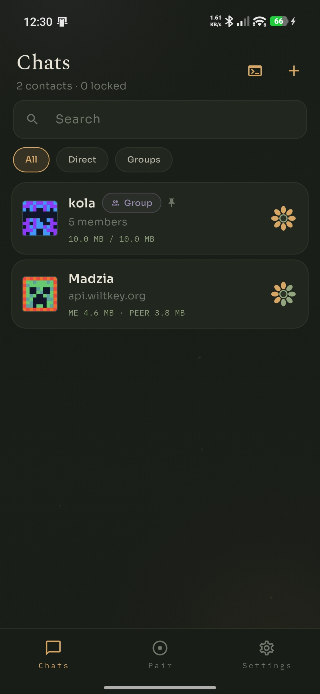
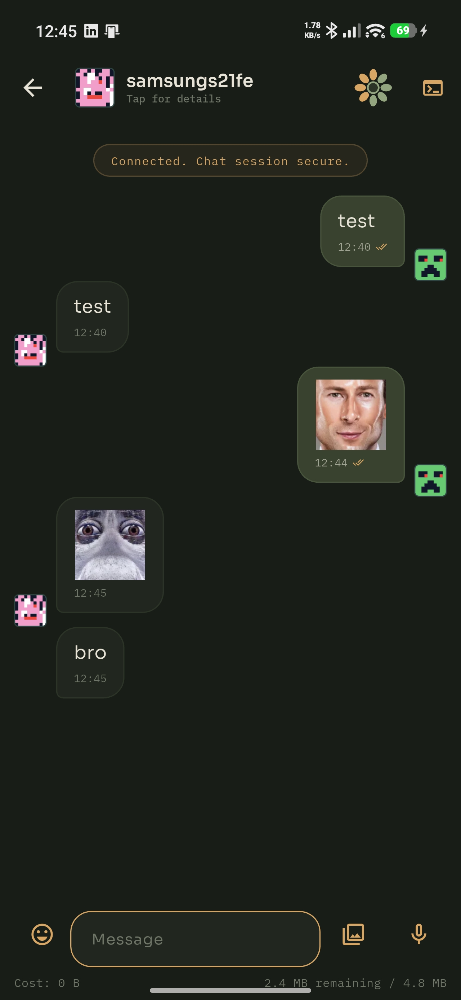
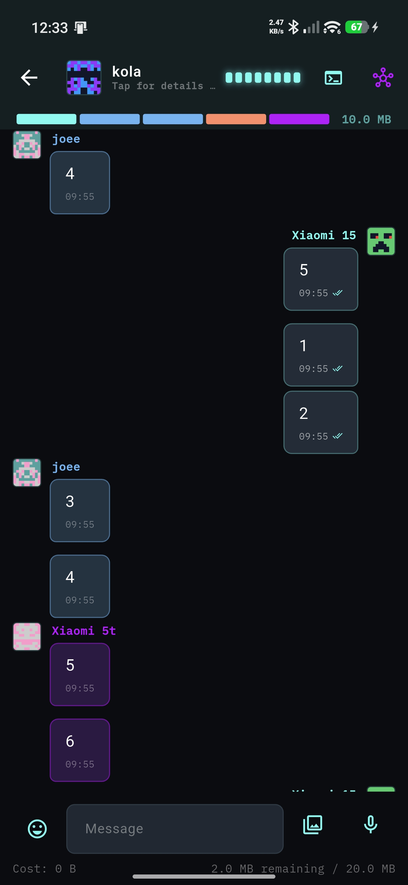
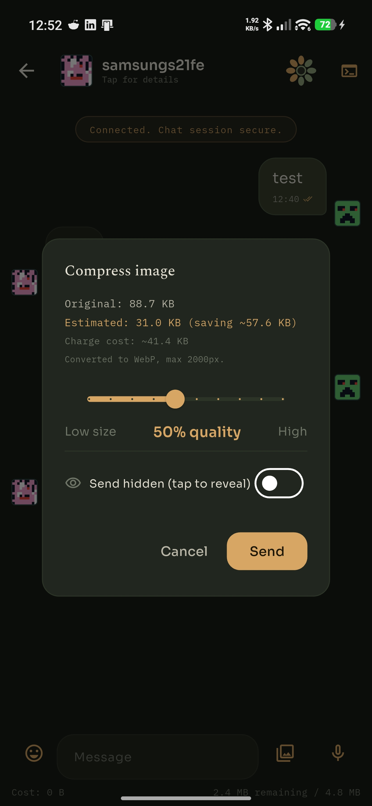
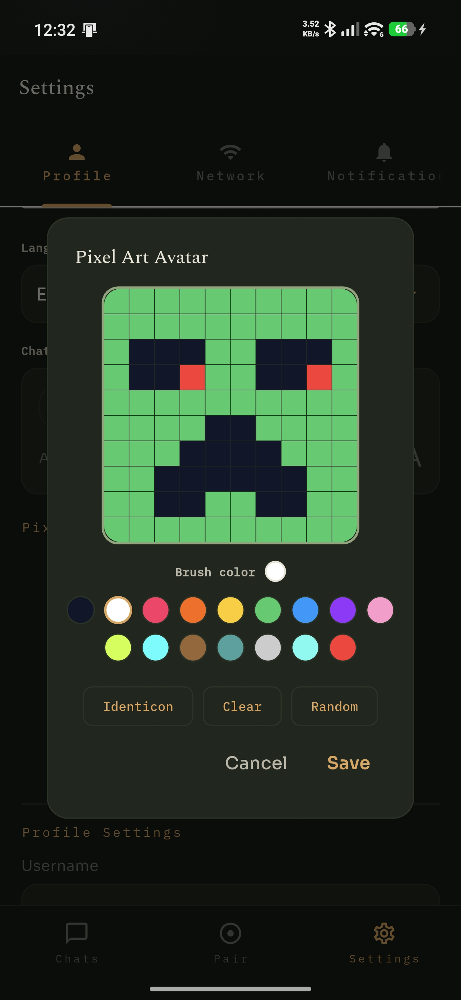
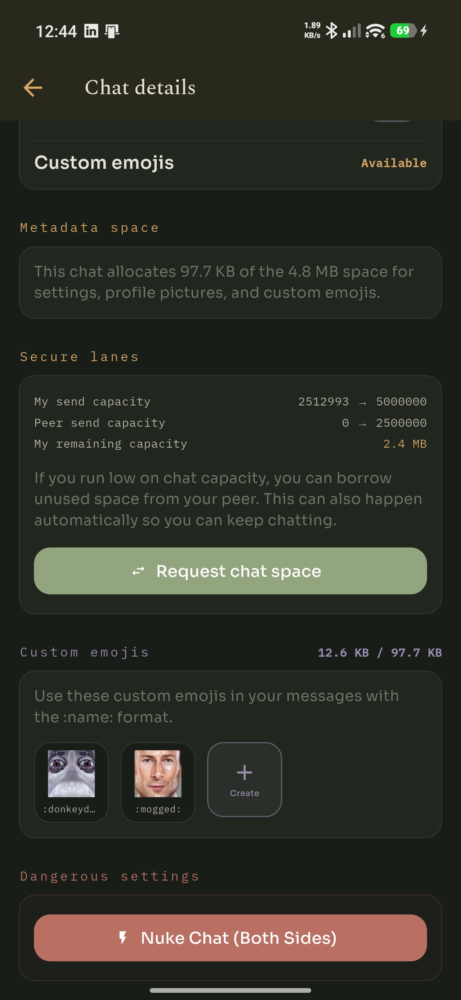

<div align="center">

# WiltKey

**A private messenger for people who'd rather be off their phone. Make friends you actually see IRL.**

`v1.3.5` · Android · MPL-2.0 · made by [ArtFacility](https://github.com/ArtFacility)

<br>

[](https://github.com/ArtFacility/WiltKey/releases/latest)

<br>

</div>

> ⚠️ **Heads up:** WiltKey is a solo project and actively evolving. It's stable, fast, and daily-driven, but expect continuous improvements and new features. Bug reports and feature suggestions are always welcome.

---

WiltKey is an encrypted chat app built on a simple idea: the people worth talking to are the ones you actually know and meet in real life. 

Instead of phone numbers, email accounts, or searching random usernames, you connect with someone **in person over Bluetooth** (or via a quick **QR code** for temporary 7-day chats). There are no user accounts, no cloud databases holding your messages, and nothing tying your real-world identity to a server.

The encryption is a **one-time pad and stream cipher** — mathematically unbreakable when used properly. The relay server in the middle is completely blind: it blindly routes encrypted blobs between devices and keeps **zero** chat history. If someone is offline, their message waits temporarily in a self-expiring queue and is permanently wiped on delivery.

No infinite feeds. No streaks. No "someone is typing…" dopamine traps. It's built to help you catch up with friends before meeting up in real life.

<div align="center">
<table>
<tr>
<td></td>
<td></td>
<td></td>
</tr>
<tr>
<td align="center"><sub>Your chats</sub></td>
<td align="center"><sub>1-on-1 with custom emojis</sub></td>
<td align="center"><sub>Group chat (Cyberpunk theme)</sub></td>
</tr>
</table>
</div>

---

## What Makes It Different

- 🤝 **In-Person Bluetooth Pairing:** Two phones, Bluetooth, a few seconds. The physical meetup *is* the trust. No centralized directory, no "verify safety numbers" after the fact.
- ⚡ **Instant QR Connect:** Need to connect quickly on the go? Scan a QR code or enter a 6-digit PIN to start a 7-day Time Wilt chat. (Pad recharging stays strictly in-person over Bluetooth to protect physical security).
- 🔒 **One-Time Pad & Stream Cipher Encryption:** Messages are encrypted using fresh, non-reused keystream material. The server can never read your messages, and neither can anyone intercepting network traffic.
- 🙈 **Zero-Knowledge Blind Relay:** The relay server only sees opaque hashes and encrypted ciphertext. It maintains zero message logs, zero account databases, and zero relationship graphs.
- ⏳ **Wilting (Self-Destructing) Messages & Photos:** Hold the send button to attach a self-destruct timer (1–60s). Messages quietly dissolve after being read.
- 🎨 **Pixel-Art Avatar & Custom Emoji Creator:** Draw your own 16x16 pixel art avatar with custom color palettes and create custom `:emoji:` definitions usable inline.
- 🛡️ **Democratic Vote-to-Nuke:** Nuke a 1:1 chat to wipe all messages and keys from both devices simultaneously. In group chats, destroying a group requires a majority vote from members.
- 🎙️ **Hands-Free Voice Notes:** Slide up to lock recording hands-free with real-time waveform preview and automatic byte-budget protection.
- 🏷️ **Client Integrity Badges:** Cryptographically verifiable build authenticity tags—Official Google Play builds show a Shield (Golden Shield for Plus supporters), while community/custom builds display an Open Source tinkerer badge.
- 💬 **All the Essentials You Expect:** Photo sharing with live compression & hidden tap-to-reveal mode, shared Media/Voice/Links gallery, configurable message history retention (keep last 100–1000 messages or clear history), markdown formatting, quote swipe-to-reply, emoji reactions (`🗿`), `@mention` autocomplete, muted chats, PIN/fingerprint lock, screenshot protection, and multiple themes (Garden, Cyberpunk, Paper-ink).

<div align="center">
<table>
<tr>
<td></td>
<td></td>
<td></td>
</tr>
<tr>
<td align="center"><sub>Send images with live compression + "send hidden"</sub></td>
<td align="center"><sub>Draw your own pixel avatar</sub></td>
<td align="center"><sub>Per-chat space, emojis & both-sides nuke</sub></td>
</tr>
</table>
</div>

---

<div align="center">

## 📥 Get WiltKey

Looking for the APK? You can download the latest standalone release directly:

[](https://github.com/ArtFacility/WiltKey/releases/latest)

*(No Google Play Services required for the FOSS build — runs 100% on-device).*

</div>

---

## Roadmap & What's Next

Here is what's on the radar:

- **More profile features:** including wilting stories (ephemeral 24h photo/status drops for mutual contacts).
- **More groupchat/social stuff:** votekick, location sharings, permission related features, profile pic sharing, etc.
- **True OTP generator:** exploring hardware/entropy-backed random pad generation.
- **Meshtastic support:** I am contemplating off-grid/Meshtastic support, but don't count on it, I'm still  looking into it.
- **Community-driven features:** whatever people request enough that makes sense and doesn't compromise on privacy and the wilting "meet up to chat" philosophy of the app.

No promises — this is an project developed next to my job+raising my kid.

---

## Under the Hood & Documentation

For interactive diagrams, specs, and technical documentation:

- 🌐 **Interactive Architecture & Protocol Animations:** [wiltkey.org/architecture.html](https://wiltkey.org/architecture.html)
- 📚 **Full Developer Documentation Portal:** [wiltkey.org/docs/](https://wiltkey.org/docs/)
- 📜 **Complete Version History & Patch Notes:** [wiltkey.org/patchnotes.html](https://wiltkey.org/patchnotes.html)

### How It Fits Together

- **Client (`wiltkey_client/`):** Built with Flutter (Android). Cryptographic identities are local Ed25519 keypairs. All private chat data is stored encrypted-at-rest with an AES-256 master key derived from the user's PIN using iterative SHA-256 KDF.
- **Blind Relay (`wiltkey_server/`):** Written in Go. Handles WebSocket routing and temporary Redis/PostgreSQL queueing. Employs Ed25519 challenge-response authentication (`/ws`), anti-replay nonces, and Google Play Integrity verification.
- **Channel Isolation:** Privacy-critical chat content rides the OTP/keystream channel. Lightweight profile metadata and reactions ride a separate AES-encrypted metadata channel that never consumes one-time pad bytes.

---

## Building from Source

You'll need the [Flutter SDK](https://docs.flutter.dev/get-started/install).

```bash
# Clone the repository
git clone https://github.com/ArtFacility/WiltKey
cd WiltKey/wiltkey_client

# Fetch dependencies & generate localizations
flutter clean
flutter pub get
flutter gen-l10n

# Run / Build FOSS flavor (100% Google-free)
flutter run --flavor foss --dart-define=WK_FCM=false
flutter build apk --release --flavor foss --dart-define=WK_FCM=false
```

### Build Flavors

- **`foss`:** Zero proprietary Google dependencies or libraries. Notifications run completely on-device using a lightweight background connection.
- **`play`:** The Google Play Store build. Integrates optional Firebase Cloud Messaging for content-free push wakeups and Google Play Billing/Integrity. Requires `--flavor play --dart-define=WK_FCM=true --dart-define=WK_PLAY=true`.

To run your own relay server, check the [Self-Hosting Guide](https://wiltkey.org/docs/relay-server.html#self-hosting) in `wiltkey_server/`.

---

## Contributing & Localization

The easiest and most impactful way to contribute is **translations**:

```text
wiltkey_client/lib/l10n/
  app_en.arb                  # English source strings
  app_localizations_*.dart    # Generated per-language files
```

WiltKey currently supports 8 languages: English (`en`), German (`de`), French (`fr`), Hungarian (`hu`), Polish (`pl`), Swedish (`sv`), and Chinese (`zh`). If you notice awkward phrasing or want to add a new language, PRs are warmly welcomed!

---

## License

WiltKey is licensed under the **Mozilla Public License 2.0**. See [LICENSE.md](LICENSE.md).
